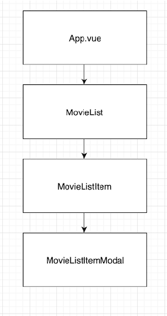
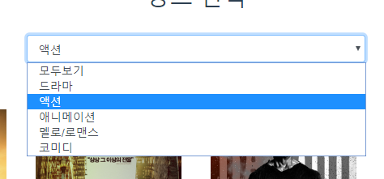

# 09 - Vue

## 1. 목표

* Node 개발 환경과 webpack에 대한 이해
* 컴포넌트 기반의 구조에 대한 이해
* axios를 통한 비동기적 데이터 처리에 대한 이해
* Vue.js 개발 프로세스를 통한 영화 목록 페이지 구현

## 2. 준비 사항

1. **(필수)** Node 개발 환경 12.x, Vue 2.x

## 3. 컴포넌트 구조




## 4. 구현

1. `App.vue`

   * [코드](./movie/src/App.vue)

   * 최상위 컴포넌트로 실행되는 시점에 외부로부터 아래의 데이터를 비동기적으로 받아온다.

     * axios를 활용하여 아래의 구조로 되어있는 파일의 형식을 가진 JSON 데이터를 받는다.

     * `movies.json`

       * 예시)

         ```json
         [
         	{
                 "id": 12,
                 "title": "조커",
                 "rating": "15세이상관람가",
                 "genre_id": 2,
                 "director": "토드 필립스",
                 "user_rating": 8.67,
                 "poster_url": "https://moviephinf.
                 pstatic.net/20190906_128/1567761736426S6Fje_JPEG/movie_i
                 mage.jpg",
                 "description": "고담시의 ..."
         	},
         ]
         ```

     * `genre.json`

       ```json
       [
           {
               "id": 1,
               "name": "드라마"
           },
           {
               "id": 2,
               "name": "액션"
           },
           {
               "id": 3,
               "name": "애니메이션"
           },
           {
               "id": 4,
               "name": "멜로/로맨스"
           },
           {
               "id": 5,
               "name": "코미디"
           }
       ]
       ```

   * 가져온 데이터는 영화 목록을 구성하는 다음의 컴포넌트로 전달한다.

2. `MovieList.vue`

   * [코드](./movie/src/components/movies/MovieList.vue)

   * 영화 목록을 구성하는 컴포넌트이며, 장르에 따라 서로 다른 영화 목록을 출력한다.
   * 개별 영화 컴포넌트를 반복하여 배치하는 작업을 진행한다.
   * 드롭다운을 통한 장르 선택시 필터링 된 영화들을 실시간으로 변경하여 출력한다.
   * 미선택시에는 모든 영화를 출력한다.
   * 개별 영화 정보들을 다음의 컴포넌트로 각각 전달한다.

3. `MovieListItem.vue`

   * [코드](./movie/src/components/movies/MovieListItem.vue)

   * 개별 영화를 포스터/제목/상세보기 버튼으로 구성한 컴포넌트이다.
   * 영화 상세보기 버튼을 누르면 `MovieListItemModal.vue` 를 확인할 수 있다.
   * 해당 영화 정보를 다음의 컴포넌트로 전달한다.

4. `MovieListItemModal.vue`

   * [코드](./movie/src/components/movies/MovieListItemModal.vue)

   * 영화 정보 상세보기를 누르면 보이는 컴포넌트이다.
   * 활용 가능한 데이터들을 확인하고, 원하는 위치에 출력한다.

## 5. 결과물

1. 컴포넌트 구조

   * `App.vue`, `MovieList.vue`, `MovieListItem.vue`

     

   * `MovieListItemModal.vue`

     

2. 드롭다운

   * 장르별로 선택이 가능하다.

   

   * 모두보기 했을 때

     

   * 액션을 선택했을 때 

     

